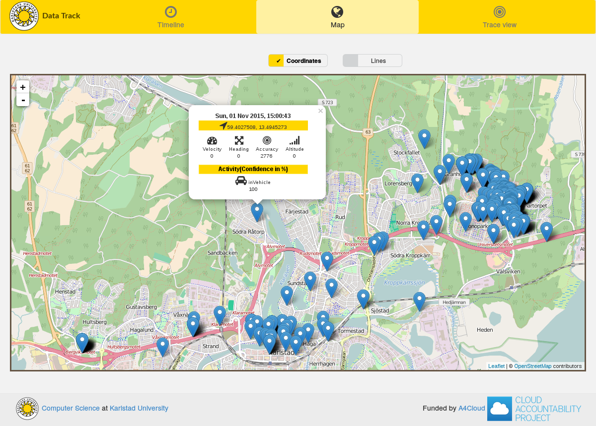

# The Data Track
The Data Track is a tool that visualizes data disclosures you have made online.
The different visualizations enable you to better understand what online
services know about you. The Data Track is a *proof-of-concept* and only supports
parsing your location history from Google's
[Takeout](https://myaccount.google.com/intro/privacy) service.

## Usage
1. Download or build the Data Track from source (see below).
2. Start the Data Track by running the `datatrack` executable.
3. A browser window should have opened, if not, browse to
[http://localhost:8000](http://localhost:8000).
4. Either follow the provided instructions to download your own data from Google
or use the provided `takeout example.zip` file.
5. Explore the data disclosures. Once you're done, close the Data Track and all
data created by the Data Track will be destroyed.

## Download
See [releases](https://github.com/pylls/datatrack/releases).

## Privacy and the Data Track
Please note that the Data Track is a tool you run on your own device (Windows,
  OS X and Linux 64-bit are supported) that uses your browser to show its user
  interface (Firefox and Chrome tested). We send no data over the network, and
  only retrieve tiles (images) loaded from [OpenStreetMap](http://www.openstreetmap.org/)
  if you use the map view. We enforce this limitation with a [Content Security Policy](https://en.wikipedia.org/wiki/Content_Security_Policy).
  When the Data Track parses your data locally it stores part of the data in an
  encrypted internal database (TODO: the database is a key-value store, and keys
  are currently stored in the clear. We need order-preserving encryption or a
  restructuring of our indexes.). The encryption key is randomly generated each
  time you launch the Data Track and subsequently deleted together with the
  database when you close the Data Track.

## Development
The Data Track is developed by [Computer Science](https://www.kau.se/cs) at
[Karlstad University](https://www.kau.se/). The Data Track is a result from the
EU FP7 research project [A4Cloud](http://www.a4cloud.eu/), grant agreement no.
317550.

## Build From source
Install [Go](https://golang.org). Clone this repo:

    $ go get github.com/pylls/datatrack/

Then build:

    $ go build -o bin/datatrack datatrack/server

Run the Data Track:

    $ ./bin/datatrack

## License
The Data Track is released under [Apache 2.0](LICENSE). We use a number of
different third-party libraries, for details see
[Third-party licenses.md](Third-party licenses.md).
